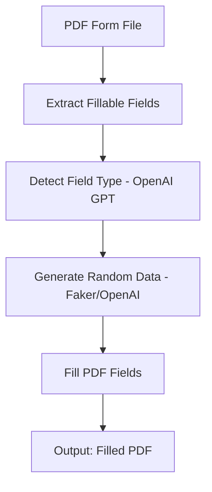
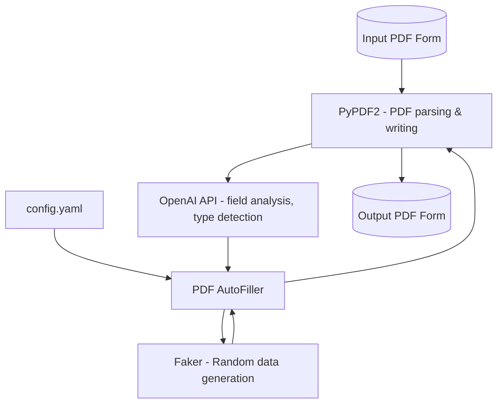

# PDF AutoFiller

> **Generate random, realistic test data in your fillable PDF forms using AI and Faker**

---

## 📝 Overview and Purpose

PDF AutoFiller is a command-line tool designed to automate the generation of random, yet realistic, test data directly into fillable PDF forms. By leveraging both [Faker](https://faker.readthedocs.io/) for data generation and [OpenAI](https://openai.com/) GPT for smart field-type detection, it streamlines QA, UAT, and developer workflows where bulk realistic PDF data is needed fast.

---

## 🏗️ System Description & Architecture

PDF AutoFiller intelligently reads a PDF form, detects each fillable field, infers its "type" (name, date, email, etc.) using OpenAI, then auto-populates the form with randomized but valid data using Faker.

### High-Level Workflow



### Component Overview



---

## 🚀 Installation & Setup

### Prerequisites
- Python 3.12+
- An [OpenAI API Key](https://platform.openai.com/account/api-keys)

### Install Steps

1. **Clone the repository (or extract the zip):**
   ```bash
   git clone <repo-url> pdf-autofiller
   cd pdf-autofiller
   ```

2. **Install dependencies:**
   ```bash
   pip install -r requirements.txt
   ```

3. **Configure OpenAI:**
   - Copy `config.yaml` and insert your OpenAI API key.

---

## ⚙️ Configuration

The application uses a `config.yaml` file for OpenAI settings:

```yaml
openai:
  api_key: "sk-..."          # Your OpenAI API key
  model: "gpt-3.5-turbo"     # (Optional) Model, e.g., gpt-4, gpt-3.5-turbo
  endpoint_url: ""           # (Optional) Custom endpoint, else leave blank
```

---

## 📈 Usage Instructions

### Basic Usage

```bash
python pdf_autofiller.py --input input.pdf --output filled.pdf
```

### Options

| Argument          | Description                                  | Example                  |
|-------------------|----------------------------------------------|--------------------------|
| `--input`         | Path to input fillable PDF                   | `--input form.pdf`       |
| `--output`        | Path to output filled PDF                    | `--output testout.pdf`   |
| `--config`        | Path to configuration YAML (optional)        | `--config custom.yaml`   |
| `--count`         | Number of filled PDFs to generate (optional) | `--count 10`             |

### Example Command

Generate 5 filled PDFs from a single template:

```bash
python pdf_autofiller.py --input myform.pdf --output filled.pdf --count 5
```

### How it works

- The tool reads every fillable field in your input PDF.
- For each field:
  - Uses OpenAI GPT to guess what "kind" of data it should be.
  - Uses Faker to generate random, realistic data of that kind.
- Fills the fields and writes a new PDF (or multiple PDFs).

---
## Screnshots


